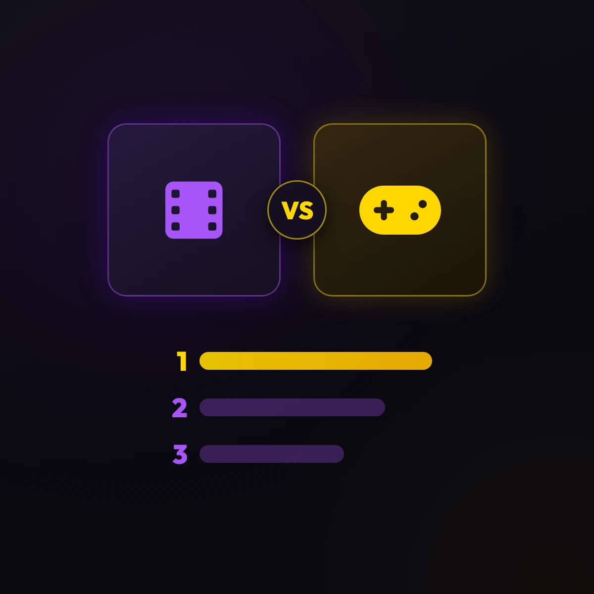

  

  <strong>Rank your stuff — no tiers, no noise, just accurate 1v1 rankings.</strong>

  <strong><a href="https://rankmaker.net/">Play it at rankmaker.net</a></strong>

  

RANKMAKER turns preferences into an ordered list through fast head-to-head
battles. Instead of sorting dozens of options into tier-list buckets by hand,
you pick the winner of one duel after another, and the ranking takes shape from
the choices you actually made.

## What you can do

- **Rank anything**: browse official and community templates for movies, music,
  video games, sports, foods, characters, and much more.
- **Create your own**: build a template with 4 to 50 options and share it with a
  single link.
- **Try it as a guest**: rank eligible templates locally without an account, and
  sign in later only if you want to save or share.
- **Make it yours**: undo, skip, finish early, review your battle history, or
  adjust the final order by hand.
- **Share the result**: send a link to your finished ranking or download it as
  an image.
- **Join the community**: creator profiles, follows, saves, comments, and
  "times ranked" counters.
- **Use your language**: the interface speaks English, Spanish, French, German,
  Portuguese, Chinese, and Malay.

## Bugs, ideas, and feedback

This repository is RANKMAKER's public home and the place to talk about the
product. Everything is welcome — a typo, a confusing screen, a broken ranking,
or a feature you would love to see.

- **Found a bug?** [Report it](https://github.com/martinezharo/rankmaker/issues/new?template=bug.yml) — a screenshot or a link to the template helps a lot.
- **Have an idea?** [Suggest it](https://github.com/martinezharo/rankmaker/issues/new?template=suggestion.yml).
- **Anything else?** [Open an issue](https://github.com/martinezharo/rankmaker/issues/new) and tell us.

The source code is not public. This repository exists for the community: bug
reports, suggestions, and announcements about the product.

## Links

- **Play RANKMAKER**: <https://rankmaker.net/>
- **About**: <https://rankmaker.net/about>
- **Privacy policy**: <https://rankmaker.net/privacy-policy>
- **Terms of use**: <https://rankmaker.net/terms-of-use>
